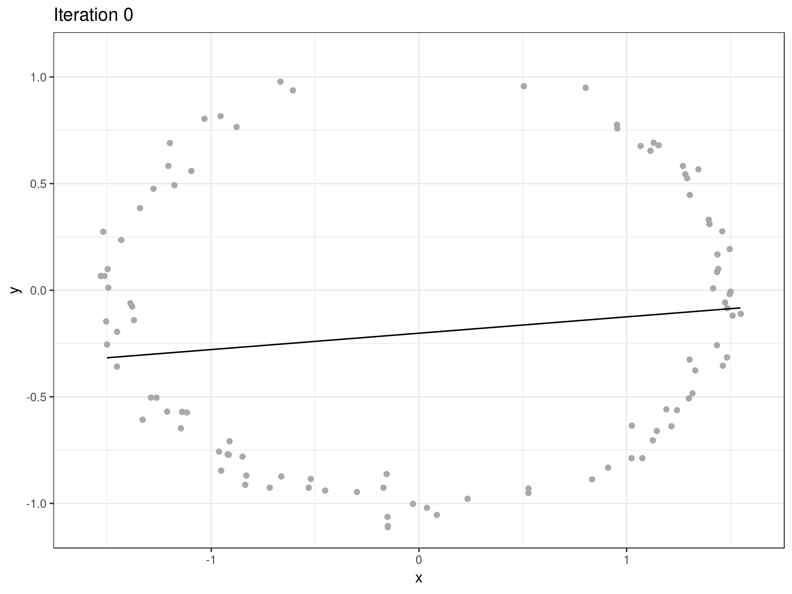

<!-- README.md is generated from README.Rmd. Please edit that file -->
princurve
=========

[](https://travis-ci.org/dynverse/princurve) [](https://ci.appveyor.com/project/dynverse/princurve) [](https://cran.r-project.org/package=princurve) [](https://codecov.io/gh/dynverse/princurve?branch=master)

Fitting a principal curve to a data matrix in arbitrary dimensions. A principal curve is a smooth curve passing through the middle of a multidimensional dataset. This package is an R/C++ reimplementation of the S/Fortran code provided by Trevor Hastie, with multiple performance tweaks.

Deriving a principal curve is an iterative process. This is what it looks like for a two-dimensional toy dataset:

``` r
library(princurve)
library(magick)

ggif_list <- function(list, .width = 8, .height = 6, .dpi = 300, .fps = 1, ...) {
  dir <- tempfile("gif_files")
  dir.create(dir)
  on.exit(unlink(dir))
  
  img <- lapply(
    seq_along(list),
    function(i) {
      filename <- paste0(dir, "/image-", i, ".png")
      ggsave(filename, list[[i]], width = .width, height = .height, dpi = .dpi)
      image_read(filename)
    }
  )
  
  image_animate(do.call(c, img), fps = .fps, dispose = "none")
}

ggif_lapply <- function(X, FUN, .width = 8, .height = 6, .dpi = 300, .fps = 1, ...) {
  list <- lapply(X, FUN)
  ggif_list(list, .width = .width, .height = .height, .dpi = .dpi, .fps = .fps, ...)
}

set.seed(1)
z <- sort(runif(100, -1.4 * pi, .4 * pi))
s <- data_frame(
  x = cos(z) * 1.5,
  y = sin(z)
)
x <- s %>% 
  sample_frac(1) %>% 
  mutate(
    x = x + rnorm(length(x), 0, .05),
    y = y + rnorm(length(x), 0, .05)
  )

ggif_lapply(seq(0, 10), function(it) {
  fit <- principal_curve(as.matrix(x), maxit = it)
  
  curve <- 
    as_data_frame(fit$s) %>% 
    mutate(lambda = fit$lambda, it = it) %>% 
    slice(fit$ord) %>% 
    mutate(pos = seq_len(n()))
  
  ggplot() +
    geom_point(aes(x, y), x, colour = "darkgray") +
    geom_path(aes(x, y), curve) +
    theme_bw() +
    coord_cartesian(xlim = c(-1.6, 1.6), ylim = c(-1.1, 1.1)) +
    labs(title = paste0("Iteration ", it)) 
})
```



For more information on how to use the `princurve` package, check out the following resources:

-   Vignette: [Introduction to the princurve package](https://cran.r-project.org/web/packages/princurve/vignettes/intro.html)
-   Help files: `?principal_curve`

Latest changes
--------------

Check out `news(package = "princurve")` or [NEWS.md](inst/NEWS.md) for a full list of changes.

<!-- This section gets automatically generated from inst/NEWS.md, and also generates inst/NEWS -->
### Latest changes in princurve 2.1.2 (unreleased)

-   DOCUMENTATION: Use the `magick` package to generate animated GIFs in the vignette, instead of the `animation` package, because `animation` uses `ffmpeg` which is not installed on all CRAN systems.

-   DEPRECATION: Added deprecation which will be triggered starting from 2018-08-01 upon calling `principal.curve()` or `get.lam()`.

### Latest changes in princurve 2.1.1 (2018-07-23)

-   DOCUMENTATION: Added vignettes on the algorithm behind princurve and on benchmarking results between princurve 1.1 and 2.1.

-   BUG FIX `principal_curve()`: Don't apply rownames to curve as approx\_points could be set to a different value other than `nrow(x)`.

-   TESTING: Skip comparison unit test between princurve 1.1 and 2.1 on CRAN.

-   MINOR CHANGE `project_to_curve()`: Attempt to fix rchk warnings by not using `x(i, j) = v` notation but instead `x[j * x.nrow() + i] = v`.

-   DOCUMENTATION: Fix in README documentation.

References
----------

Hastie, T. and Stuetzle, W., [Principal Curves](https://www.jstor.org/stable/2289936), JASA, Vol. 84, No. 406 (Jun., 1989), pp. 502-516, DOI: [10.2307/2289936](http://doi.org/10.2307/2289936) ([PDF](https://web.stanford.edu/~hastie/Papers/principalcurves.pdf))
