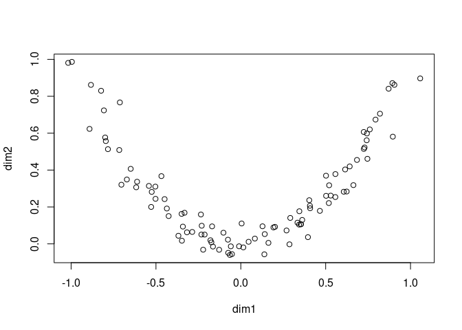
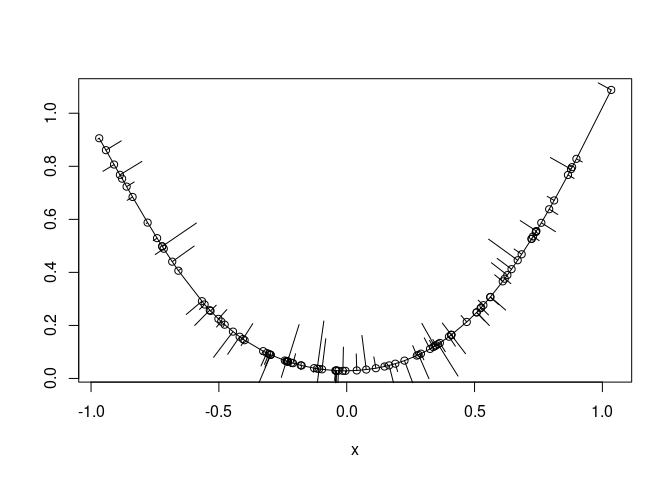

<!-- README.md is generated from README.Rmd. Please edit that file -->
princurve
=========

[](https://travis-ci.org/dynverse/princurve) [](https://ci.appveyor.com/project/dynverse/princurve) [](https://cran.r-project.org/package=princurve) [](https://codecov.io/gh/dynverse/princurve?branch=master)

Fitting a principal curve to a data matrix in arbitrary dimensions.

Example
-------

We generate some example data:

``` r
t <- runif(100, -1, 1)
x <- cbind(t, t ^ 2) + rnorm(200, sd = 0.05)
colnames(x) <- c("dim1", "dim2")

plot(x)
```



A principal curve can be fit to the data as follows:

``` r
library(princurve)
fit <- principal_curve(x)
plot(fit); whiskers(x, fit$s, col = "gray")
```



Check out `?principal_curve` for more information on the specific outputs of `principal_curve()`.

<!-- ## Latest changes -->
<!-- This section gets automatically generated from inst/NEWS.md, and also generates inst/NEWS -->
Latest changes in princurve 2.0.4 (2018-07-09)
----------------------------------------------

-   BUG FIX: Fixed issues with legacy `principal.curve()` and `get.lam()` (\#8).

-   TESTING: Perform direct comparison between the current princurve and princurve 1.1-12 to check whether `principal.curve()` and `get.lam()` produce output with exactly the same format and almost exactly the same values.

-   SIGNIFICANT CHANGE: Remove the `ord` parameter from `project_to_curve()`, in order to reduce the amount of Rcpp code a little bit.

-   DOCUMENTATION: Improved citations (\#10).

-   DOCUMENTATION: Improved news (\#11).

-   SPEED UP `project_to_curve`: Do not compute `lambda` accurately as it is only used to order the points in `x`.

-   MINOR CHANGE: Added `...` argument to `whiskers()`.

-   DOCUMENTATION: Minor fix in output documentation of `principal_curve()`.

-   DOCUMENTATION: Added more information to the README.

-   MINOR CHANGE: Support both `news()` and markdown news on GitHub.

Check [NEWS.md](inst/NEWS.md) for full list of changes.

References
----------

Hastie, T. and Stuetzle, W., [Principal Curves](https://www.jstor.org/stable/2289936), JASA, Vol. 84, No. 406 (Jun., 1989), pp. 502-516, DOI: [10.2307/2289936](http://doi.org/10.2307/2289936) ([PDF](https://web.stanford.edu/~hastie/Papers/principalcurves.pdf))
