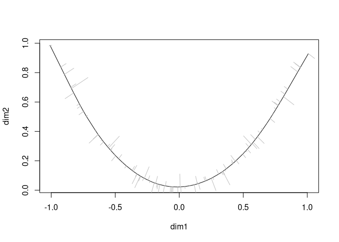

<!-- README.md is generated from README.Rmd. Please edit that file -->

# princurve

[](https://cran.r-project.org/package=princurve)
[](https://cran.r-project.org/package=princurve)
[](https://zenodo.org/badge/latestdoi/125849601)  
[](https://github.com/rcannood/princurve/actions?query=workflow%3AR-CMD-check)
[](https://codecov.io/gh/rcannood/princurve?branch=master)

Fitting a principal curve to a data matrix in arbitrary dimensions. A
principal curve is a smooth curve passing through the middle of a
multidimensional dataset. This package is an R/C++ reimplementation of
the S/Fortran code provided by Trevor Hastie, with multiple performance
tweaks.

## Example

Usage of princurve is demonstrated with a toy dataset.

``` r
t <- runif(100, -1, 1)
x <- cbind(t, t ^ 2) + rnorm(200, sd = 0.05)
colnames(x) <- c("dim1", "dim2")

plot(x)
```

<!-- -->

A principal curve can be fit to the data as follows:

``` r
library(princurve)
fit <- principal_curve(x)
plot(fit); whiskers(x, fit$s, col = "gray")
```

<!-- -->

See `?principal_curve` for more information on how to use the
`princurve` package.

## Latest changes

Check out `news(package = "princurve")` or [NEWS.md](NEWS.md) for a full
list of changes.

<!-- This section gets automatically generated from NEWS.md -->

### Recent changes in princurve 2.1.6 (2021-01-17)

-   BUG FIX `project_to_curve()`: Return error message when `x` or `s`
    contain insufficient rows.

-   BUG FIX unit tests: Switch from `svg()` to `pdf()` as support for
    `svg()` might be optional.

### Recent changes in princurve 2.1.5 (2020-08-13)

-   BUG FIX `project_to_curve()`: Fix pass-by-reference bug, issue \#33.
    Thanks to @szcf-weiya for detecting and fixing this bug!

## References

Hastie, T. and Stuetzle, W., [Principal
Curves](https://www.jstor.org/stable/2289936), JASA, Vol. 84, No. 406
(Jun., 1989), pp. 502-516, DOI:
[10.2307/2289936](https://doi.org/10.2307/2289936)
([PDF](https://web.stanford.edu/~hastie/Papers/principalcurves.pdf))
