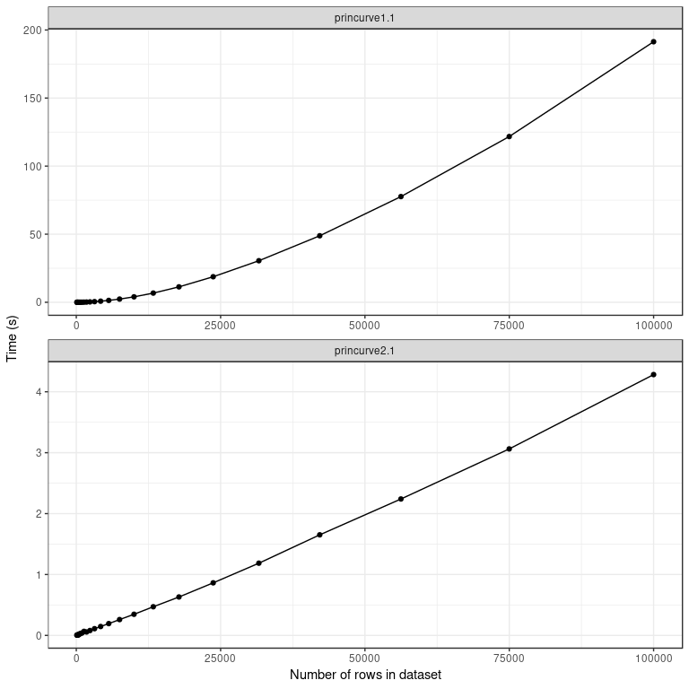

<!-- README.md is generated from README.Rmd. Please edit that file -->
princurve
=========

[](https://travis-ci.org/dynverse/princurve) [](https://ci.appveyor.com/project/dynverse/princurve) [](https://cran.r-project.org/package=princurve) [](https://codecov.io/gh/dynverse/princurve?branch=master)

Fitting a principal curve to a data matrix in arbitrary dimensions.

Example
-------

We generate some example data:

``` r
t <- runif(100, -1, 1)
x <- cbind(t, t ^ 2) + rnorm(200, sd = 0.05)
colnames(x) <- c("dim1", "dim2")

plot(x)
```


A principal curve can be fit to the data as follows:

``` r
library(princurve)
fit <- principal_curve(x)
plot(fit); whiskers(x, fit$s, col = "gray")
```


Check out `?principal_curve` for more information on the specific outputs of `principal_curve()`. An overview of the principal curve algorithm is given in the [algorithm](https://cran.r-project.org/web/packages/princurve/vignettes/algorithm.html) vignette.

Benchmarks
----------

Using the experimental `approx_points` parameter, princurve 2.1.0 offers major performance improvements for large datasets.

``` r
data("benchmarks", package = "princurve")
ggplot(benchmarks, aes(num_points, median / 1000)) +
  geom_point() +
  geom_line() +
  facet_wrap(~expr, ncol = 1, scales = "free") +
  theme_bw() +
  labs(x = "Number of rows in dataset", y = "Time (s)") +
  scale_colour_brewer(palette = "Set1")
```



Read more about this feature in the [benchmarks](https://cran.r-project.org/web/packages/princurve/vignettes/benchmark.html) vignette.

<!-- ## Latest changes -->
<!-- This section gets automatically generated from inst/NEWS.md, and also generates inst/NEWS -->
Latest changes in princurve 2.1.2 (unreleased)
----------------------------------------------

-   DOCUMENTATION: Use the `magick` package to generate animated GIFs in the vignette, instead of the `animation` package, because `animation` uses `ffmpeg` which is not installed on all CRAN systems.

-   DEPRECATION: Added deprecation which will be triggered starting from 2018-08-01 upon calling `principal.curve()` or `get.lam()`.

Latest changes in princurve 2.1.1 (2018-07-23)
----------------------------------------------

-   DOCUMENTATION: Added vignettes on the algorithm behind princurve and on benchmarking results between princurve 1.1 and 2.1.

-   BUG FIX `principal_curve()`: Don't apply rownames to curve as approx\_points could be set to a different value other than `nrow(x)`.

-   TESTING: Skip comparison unit test between princurve 1.1 and 2.1 on CRAN.

-   MINOR CHANGE `project_to_curve()`: Attempt to fix rchk warnings by not using `x(i, j) = v` notation but instead `x[j * x.nrow() + i] = v`.

-   DOCUMENTATION: Fix in README documentation.

Check [NEWS.md](inst/NEWS.md) for a full list of changes.

References
----------

Hastie, T. and Stuetzle, W., [Principal Curves](https://www.jstor.org/stable/2289936), JASA, Vol. 84, No. 406 (Jun., 1989), pp. 502-516, DOI: [10.2307/2289936](http://doi.org/10.2307/2289936) ([PDF](https://web.stanford.edu/~hastie/Papers/principalcurves.pdf))
