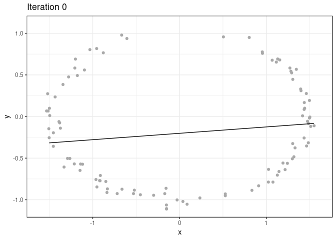
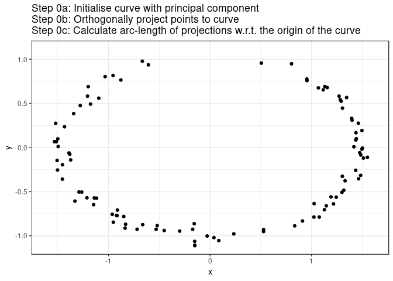
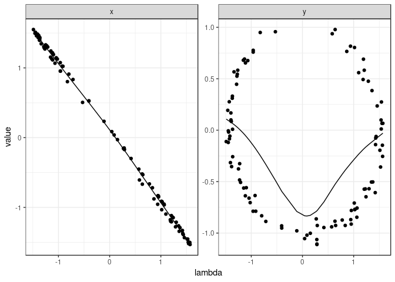
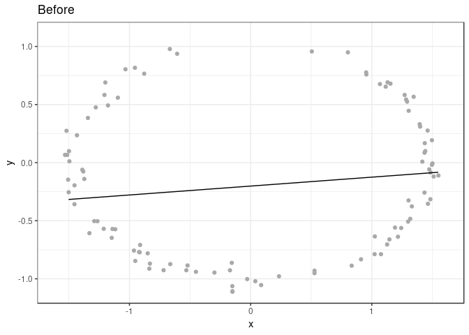
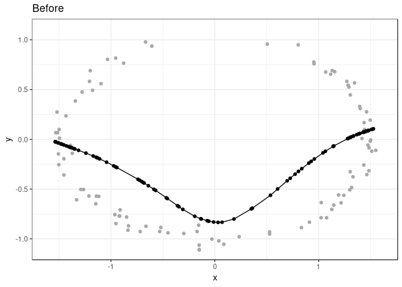
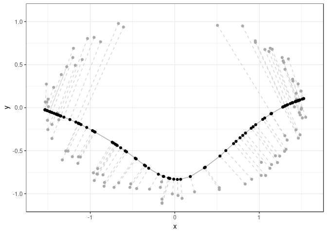
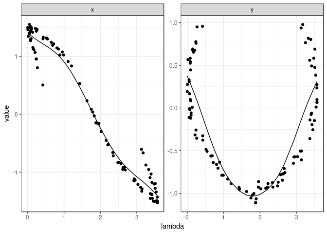
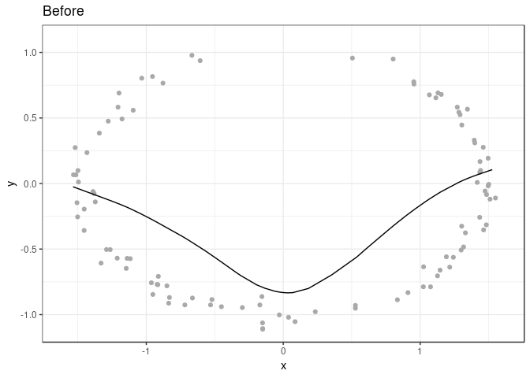
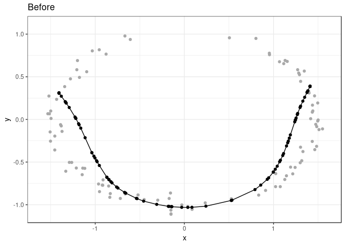
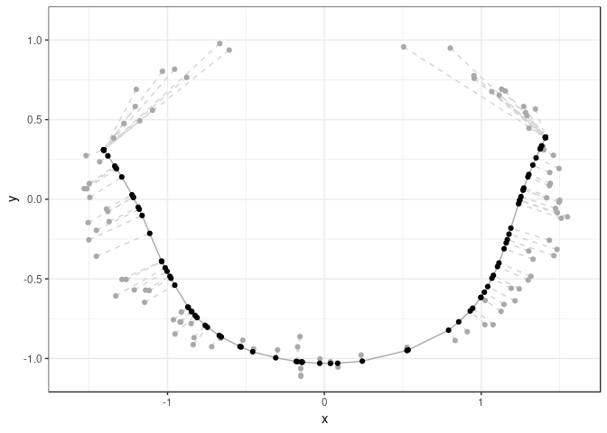

Explanation of the principal curve algorithm
================
Robrecht Cannoodt

<!-- github markdown using
rmarkdown::render("vignettes/algorithm.Rmd", output_format = "github_document")
-->
The workings of calculating a principal curve is explained with an example. Calculating the principal curves is an interative process.



Pseudocode
----------

``` r
s = principal_component(x)
x_proj = project(x, s)
lambda = arc_length(x_proj)

for (it = 1..max_iter) {
  s = smooth(lambda, x)
  s = approximate(s)
  x_proj = project(x, s)
  lambda = arc_length(x_proj)
}
```

Initialisation
--------------

The principal curve `s` is initialised (at iteration 0) by calculating the principal component. All points in `x` are projected orthogonally onto `s`, and the arc-length `lambda` of each projection w.r.t. to the start of the curve is calculated.



Iteration 1
-----------

Each iteration consists of three steps: smoothing, approximation, and projection.

### Smoothing: calculate new curve

During the smoothing step, a new curve is computed by smoothing each dimension in `x` w.r.t. the arc-length `lambda` calculated for the previous curve.





### Approximation: simplify curve

In the next step (projection), each of the `n` points in `x` will get compared to each segment in the curve `s`. After the smoothing step, the curve consists of `n` points. Thus, the projection step would have a complexity of *O*(*n*<sup>2</sup>). In order to make this step *O*(*n*), the `approx_points = 100` parameter can be used to first approximate by a curve with 100 points.



### Projection: calculate new lambda

The projection step is same as before; all the points are orthogonally projected onto the new curve, and the arc-length `lambda` is recalculated for the new projections.



This process is repeated until convergence or until a predefined number of iterations has passed.

Iteration 2
-----------

For clarity's sake, the smoothing and projection steps are also shown for iteration 2.

### Smoothing: calculate new curve

During the smoothing step, a new curve is computed by smoothing each dimension in `x` w.r.t. the arc-length `lambda` calculated for the previous curve.





### Approximation: simplify curve

The curve is simplified in order to make the projection step easier.



### Projection: calculate new lambda

All the points are orthogonally projected onto the new curve, and the arc-length `lambda` is recalculated for the new projections.


